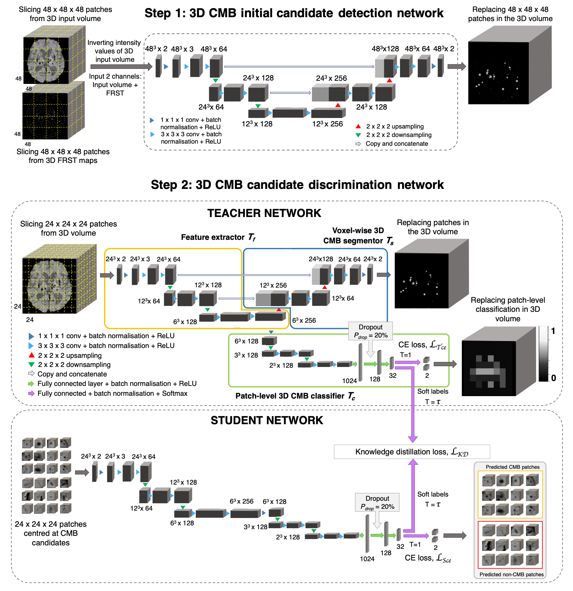

# microbleed-detection
Automated Detection of Cerebral Microbleeds (CMBs) on MR images using Knowledge Distillation Framework

Code for implementation of automated tool for CMB detection using knowledge detection.

### Preprint link: https://www.medrxiv.org/content/10.1101/2021.11.15.21266376v1.full.pdf

This is a beta release of the code for CMB detection. Any issues please contact: vaanathi@iisc.ac.in.

#### Software versions used for truenet:

- Python 3.5.2
- PyTorch 1.2.0

#### Method:


For the initial CMB candidate detection, in addition to the intensity characteristics, we use the radial symmetry property of CMBs as input along with the preprocessed input image. We used a combination of weighted cross-entropy (CE) and Dice loss functions. In candidate discrimination step, we use a student-teacher framework for classifying true CMB candidates from FPs. The teacher model uses a multi-tasking architecture consisting of three parts: 

- feature extractor (Tf ) 
- voxel-wise CMB segmentor (Ts) 
- patch-level CMB classifier (Tc)

The student model consists of the feature extractor and patch-level classifier parts (Tf + Tc) of the teacher model. We trained the student model in an offline manner using response-based knowledge distillation (KD). 


## To install the microbleednet tool
Clone the git repository into your local directory and run:
``` 
python setup.py install
```
To find about the subcommands available in microbleednet:
```
microbleednet --help
```
And for options and inputs for each sub-command, type:
```
microbleednet <subcommand> --help (e.g. microbleednet train --help)
```
#### prepare_microbleednet_data
```
Usage: prepare_microbleednet_data <input_image_name> <output_basename>
 
The script prepares the input data to be used in microbleednet with a specified output basename
input_image_name  	name of the input unprocessed  image
output_basename 	name to be used for the processed image (along with the absolute path); 
```

## Running microbleednet

Microbleed detection model using knowledge distillation framework, v1.0.1

```  
Subcommands available:
    - microbleednet train         Training a Microbleednet model from scratch
    - microbleednet evaluate      Applying a saved/pretrained Microbleednet model for testing
    - microbleednet fine_tune     Fine-tuning a saved/pretrained Microbleednetmodel from scratch
    - microbleednet loo_validate  Leave-one-out validation of Microbleednet model
```

### Training the Microbleednet model

#### microbleednet train: training the TrUE-Net model from scratch, v1.0.1

```
Usage: microbleednet train -i <input_directory> -l <label_directory> -m <model_directory> [options] 


Compulsory arguments:
       -i, --inp_dir                 Path to the directory containing FLAIR and T1 images for training 
       -l, --label_dir               Path to the directory containing manual labels for training 
       -m, --model_dir               Path to the directory where the training model or weights need to be saved 
   
Optional arguments:
       -tr_prop, --train_prop        Proportion of data used for training [0, 1]. The rest will be used for validation [default = 0.8]
       -bfactor, --batch_factor      Number of subjects to be considered for each mini-epoch [default = 10]
	-psize, --patch_size 	Size of patches extracted for candidate detection [default = 48]
  	-cand_det, —cand_detection	Train the candidate detection (step 1) model [default = True]
	-cand_disc, —cand_discrimination 	Train the candidate discrimination (step 2) model [default = True]
       -da, --data_augmentation      Applying data augmentation [default = True]
       -af, --aug_factor             Data inflation factor for augmentation [default = 2]
       -sv_resume, --save_resume_training    Whether to save and resume training in case of interruptions (default-False)
       -ilr, --init_learng_rate      Initial LR to use in scheduler [0, 0.1] [default=0.001]
       -lrm, --lr_sch_mlstone        Milestones for LR scheduler (e.g. -lrm 5 10 - to reduce LR at 5th and 10th epochs) [default = 10]
       -gamma, --lr_sch_gamma        Factor by which the LR needs to be reduced in the LR scheduler [default = 0.1]
       -opt, --optimizer             Optimizer used for training. Options:adam, sgd [default = adam]
       -bs, --batch_size             Batch size used for training [default = 8]
       -ep, --num_epochs             Number of epochs for training [default = 60]
       -es, --early_stop_val         Number of epochs to wait for progress (early stopping) [default = 20]
       -sv_mod, --save_full_model    Saving the whole model instead of weights alone [default = False]
       -cv_type, --cp_save_type      Checkpoint to be saved. Options: best, last, everyN [default = last]
       -cp_n, --cp_everyn_N          If -cv_type=everyN, the N value [default = 10]
       -v, --verbose                 Display debug messages [default = False]
       -h, --help.                   Print help message
```

### Testing the microbleednet model

### The pretrained models on MWSC and UKBB are currently available at https://drive.google.com/drive/folders/1pqTFbvPVANFngMx0Z6Z352k0xPIMa9JA?usp=sharing

#### For testing purposes, you can download the models from the above drive link into a folder and set the folder as environment variable and then run microbleednet. 
For doing this, once you download the models into a folder, please type the following in the command prompt: 
```
export MICROBLEEDNET_PRETRAINED_MODEL_PATH="/absolute/path/to/the/model/folder"
```
and then run microbleednet commands.

#### microbleednet evaluate: evaluating the Microbleednet model, v1.0.1

```
Usage: microbleednet evaluate -i <input_directory> -m <model_directory> -o <output_directory> [options]
   
Compulsory arguments:
       -i, --inp_dir                         Path to the directory containing FLAIR and T1 images for testing
       -m, --model_name                      Model basename with absolute path (will not be considered if optional argument -p=True)                                                                  
       -o, --output_dir                      Path to the directory for saving output predictions
   
Optional arguments:
       -p, --pretrained_model                Whether to use a pre-trained model, if selected True, -m (compulsory argument will not be onsidered) [default = False]
       -pmodel, --pretrained_model_name      Pre-trained model to be used: mwsc, ukbb [default = mwsc]
       -nclass, --num_classes                Number of classes in the labels used for training the model (for both pretrained models, -nclass=2) default = 2]
       -int, --intermediate                  Saving intermediate prediction results (individual planes) for each subject [default = False]
       -cv_type, --cp_load_type              Checkpoint to be loaded. Options: best, last, everyN [default = last]
       -cp_n, --cp_everyn_N                  If -cv_type = everyN, the N value [default = 10]
       -v, --verbose                         Display debug messages [default = False]
       -h, --help.                           Print help message
```

### Fine-tuning the Microbleednet model

```
Usage: microbleednet fine_tune -i <input_directory> -l <label_directory> -m <model_directory> -o <output_directory> [options]

Compulsory arguments:
       -i, --inp_dir                         Path to the directory containing FLAIR and T1 images for fine-tuning
       -l, --label_dir                       Path to the directory containing manual labels for training 
       -m, --model_dir                       Path to the directory where the trained model/weights were saved
       -o, --output_dir                      Path to the directory where the fine-tuned model/weights need to be saved
   
Optional arguments:
       -p, --pretrained_model                Whether to use a pre-trained model, if selected True, -m (compulsory argument will not be considered) [default = False]
       -pmodel, --pretrained_model_name      Pre-trained model to be used: mwsc, ukbb [default = mwsc]
       -cpld_type, --cp_load_type            Checkpoint to be loaded. Options: best, last, everyN [default = last]
       -cpld_n, --cpload_everyn_N            If everyN option was chosen for loading a checkpoint, the N value [default = 10]
       -ftlayers, --ft_layers                Layers to fine-tune starting from the decoder (e.g. 1 2 -> final two two decoder layers, refer to the figure above) 
       -tr_prop, --train_prop                Proportion of data used for fine-tuning [0, 1]. The rest will be used for validation [default = 0.8]
       -bfactor, --batch_factor              Number of subjects to be considered for each mini-epoch [default = 10]
	-psize, --patch_size 	Size of patches extracted for candidate detection [default = 48]
  	-cand_det, —cand_detection	Train the candidate detection (step 1) model [default = True]
	-cand_disc, —cand_discrimination 	Train the candidate discrimination (step 2) model [default = True]
       -da, --data_augmentation              Applying data augmentation [default = True]
       -af, --aug_factor                     Data inflation factor for augmentation [default = 2]
       -sv_resume, --save_resume_training    Whether to save and resume training in case of interruptions (default-False)
       -ilr, --init_learng_rate              Initial LR to use in scheduler for fine-tuning [0, 0.1] [default=0.0001]
       -lrm, --lr_sch_mlstone                Milestones for LR scheduler (e.g. -lrm 5 10 - to reduce LR at 5th and 10th epochs) [default = 10]
       -gamma, --lr_sch_gamma                Factor by which the LR needs to be reduced in the LR scheduler [default = 0.1]
       -opt, --optimizer                     Optimizer used for fine-tuning. Options:adam, sgd [default = adam]
       -bs, --batch_size                     Batch size used for fine-tuning [default = 8]
       -ep, --num_epochs                     Number of epochs for fine-tuning [default = 60]
       -es, --early_stop_val                 Number of fine-tuning epochs to wait for progress (early stopping) [default = 20]
       -sv_mod, --save_full_model            Saving the whole fine-tuned model instead of weights alone [default = False]
       -cv_type, --cp_save_type              Checkpoint to be saved. Options: best, last, everyN [default = last]
       -cp_n, --cp_everyn_N                  If -cv_type = everyN, the N value [default = 10]
       -v, --verbose                         Display debug messages [default = False]
       -h, --help.                           Print help message
```

### Cross-validation of Microbleednet model

#### microbleednet cross_validate: cross-validation of the Microbleednet model, v1.0.1  
   
```
Usage: microbleednet cross_validate -i <input_directory> -l <label_directory> -o <output_directory> [options]
   
Compulsory arguments:
       -i, --inp_dir                         Path to the directory containing FLAIR and T1 images for fine-tuning
       -l, --label_dir                       Path to the directory containing manual labels for training 
       -o, --output_dir                      Path to the directory for saving output predictions
   
Optional arguments:
       -fold, --cv_fold                      Number of folds for cross-validation (default = 5)
       -resume_fold, --resume_from_fold      Resume cross-validation from the specified fold (default = 1)         
       -tr_prop, --train_prop                Proportion of data used for training [0, 1]. The rest will be used for validation [default = 0.8]
       -bfactor, --batch_factor              Number of subjects to be considered for each mini-epoch [default = 10]
	-psize, --patch_size 	Size of patches extracted for candidate detection [default = 48]
  	-da, --data_augmentation              Applying data augmentation [default = True]
       -af, --aug_factor                     Data inflation factor for augmentation [default = 2]
       -sv_resume, --save_resume_training    Whether to save and resume training in case of interruptions (default-False)
       -ilr, --init_learng_rate              Initial LR to use in scheduler for training [0, 0.1] [default=0.0001]
       -lrm, --lr_sch_mlstone                Milestones for LR scheduler (e.g. -lrm 5 10 - to reduce LR at 5th and 10th epochs) [default = 10]
       -gamma, --lr_sch_gamma                Factor by which the LR needs to be reduced in the LR scheduler [default = 0.1]
       -opt, --optimizer                     Optimizer used for training. Options:adam, sgd [default = adam]
       -bs, --batch_size                     Batch size used for fine-tuning [default = 8]
       -ep, --num_epochs                     Number of epochs for fine-tuning [default = 60]
       -es, --early_stop_val                 Number of fine-tuning epochs to wait for progress (early stopping) [default = 20]
       -int, --intermediate                  Saving intermediate prediction results (individual planes) for each subject [default = False]                                                                                  
       -v, --verbose                         Display debug messages [default = False]
       -h, --help.                           Print help message
```

#### Input formats and time taken:
Currently nifti files supported and any single modality (T2* GRE/SWI/QSM) is sufficient. Similar file types supported by preprocessing codes too.

Currently the implementation takes <5mins/scan for detecting CMBs.

Also refer: https://www.frontiersin.org/articles/10.3389/fninf.2021.777828/full

If you use the tool from this repository, please cite the following papers:
```@article{sundaresan2021automated,
  title={Automated Detection of Cerebral Microbleeds on MR images using Knowledge Distillation Framework},
  author={Sundaresan, Vaanathi and Arthofer, Christoph and Zamboni, Giovanna and Murchison, Andrew G and Dineen, Robert A and Rothwell, Peter M and Auer, Dorothee P and Wang, Chaoyue and Miller, Karla L and Tendler, Benjamin C and others},
  journal={medRxiv},
  pages={2021--11},
  year={2021},
  publisher={Cold Spring Harbor Laboratory Press}
}

@article{sundaresan2022automated,
  title={Automated detection of candidate subjects with cerebral microbleeds using machine learning},
  author={Sundaresan, Vaanathi and Arthofer, Christoph and Zamboni, Giovanna and Dineen, Robert A and Rothwell, Peter M and Sotiropoulos, Stamatios N and Auer, Dorothee P and Tozer, Daniel J and Markus, Hugh S and Miller, Karla L and others},
  journal={Frontiers in Neuroinformatics},
  volume={15},
  pages={80},
  year={2022},
  publisher={Frontiers}
}
```
